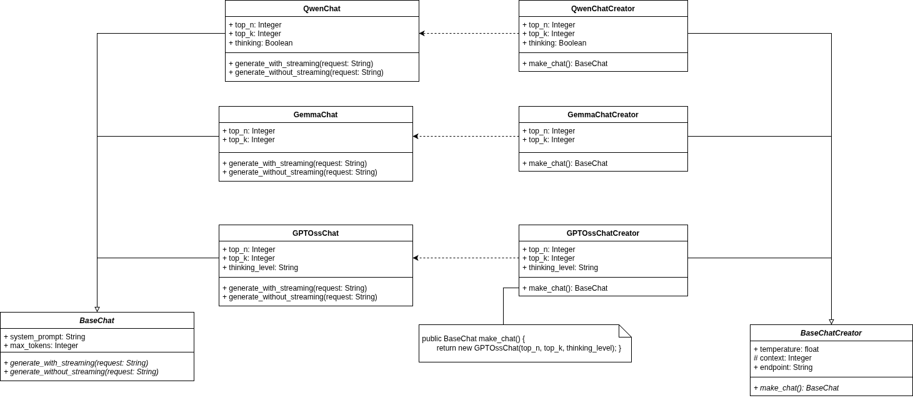

# LMGUI (Language Model User Interface)

##### Предоставляет абстракцию с графическим интерфейсом для использования поставщика Ollama через протокол HTTP. В первую очередь работа нацелена на исопльзования паттерна "Factory Method", используя язык программирования C# и WinForms. Клиентская часть - приложение с простым GUI. Главная функция клиента это взаимодействие с сервером (отправка и полуение сообщений). Серверная часть - Ollama. Выполняет все расчеты и отправляет ответ пользователю.  

## Структура репозитория

* **static**

    Статичные файлы, не изменяемые в процессе работы программы (изображения и т.п.)

## Описание проблемы:

Различные языковые модели требуют различных параметров использования (temperature, thinking, top_k, repetition_penalty...) для наивысшего качества генерируемых ответов. Паттерн **"Фабричный Метод"** как никакой другой подходит для реализации функционала создания и использования различных моделей при общих базовых фукнциях и атрибутах.

## Решение

Выбор за тем, какую модель инстанцировать определяется пользователем. Для создания базового креатора `BaseChatCreator` используется функция `get_suitable_creator`. Данная функция является единственным местом в программе с условями, изменение которых отвечает за расширяемость поддержки новых моделей. Примерный фрагмент кода данной функции:

```csharp
public BaseChatCreator GetSuitableCreator(string modelName)
{
    if (modelName == "qwen")
    {
        return new QwenChatCreator();
    }
    if (modelName == "gemma")
    {
        return new GemmaChatModel();
    }
    if (modelName == "gptoss")
    {
        return new GPTOssChatModel();
    }
    throw new Exception("Нет подходящей модели");
}
```

Стоит отметить, что классы `QwenChatCreator GemmaChatModel GPTOssChatModel` являются хранилищем параметров модели по умолчанию. Праметры по умолчанию - парметры, определенные создателем модели и считаются лучшими для стандартного использования модели.

## Диаграммы UML

### Диаграмма классов

Концепция текущего подхода может быть описана диаграммой классов



Такая архитектура позволяет обеспечить расширяемость функционала с минимальной переработкой существующего кода.

## Альтернатива без ислпользования паттерна

Без использования паттерна **"Factory Method"** создание подобного приложения потребовало бы множество ветвлений для проверок, экземпляром какого класса является обьект. Обеспечить сравнимый уровень расширяемости приложения практически невыполнимая задача. 