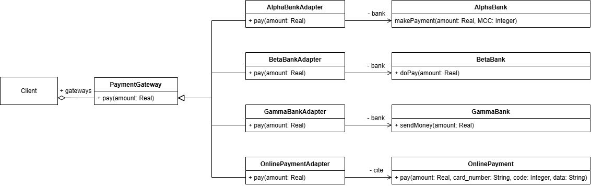

# Адаптер к платежным системам

##### Предоставляет простой графический интерфейс для взаимодействия с различными платежными системами. Графический интерфейс основан на WinAPI, что обеспечивает обратную совместимость с устаревшими версиями Windows, поддерживающих WinAPI. 

## Описание проблемы:

Различные платежные системы требуют различных данных для совершения транзакции, например, код торговой точки, номер карты, данные пользователя.\
Паттерн адаптер позволяет создать единый интерфейс для взаимодействия с платежными системами.

## Решение

Выбор способа оплаты определяется пользователем из ограниченного множества. Пользоваетль может самостоятельно выбрать сумму платежа, но не техниеские данные об оплате, поскольку это противоречит соображениям безопасности.

Ниже представлен фрагмент кода реализации паттерна адаптер на языке программирования C++.\
Адаптер *AlphaBankAdapter* реализует метод *pay* родительского класса. Внутри метода *pay* происходит вызов *makePayment* с требуемыми аргументами для оплаты при помощи *AlphaBank*. В данном примере API банка *AlphaBank* для оплаты отличается от метода *pay*, что требует адаптации для использования в коде.

```cpp
class PaymentGateway {
public:
    virtual ~PaymentGateway() {}
    virtual void pay(double amount) = 0;
};

class AlphaBankAdapter : public PaymentGateway {
    AlphaBank* bank;
public:
    AlphaBankAdapter(AlphaBank* b) : bank(b) {}
    void pay(double amount) override {
        bank->makePayment(amount, 1052);
    }
};

class AlphaBank {
public:
    void makePayment(double amount, int MCC) {
        wstring msg;
        if (MCC == 5262) {
            msg = L"AlphaBank: платеж на сумму " + to_wstring(amount) +
                L". Бонусная программа не действует на данный магазин, бонусы зачислены не будут.";
        }
        else {
            msg = L"AlphaBank: платеж на сумму " + to_wstring(amount) +
                L".\nДанный магазин участвует в бонусной программе, вам будет начислено " +
                to_wstring(static_cast<int>(amount / 10)) + L" бонусных рублей!";
        }
        MessageBox(NULL, msg.c_str(), L"AlphaBank", MB_OK);
    }
};
```


## Диаграммы UML

### Диаграмма классов

Концепция текущего подхода может быть описана диаграммой классов



Такая архитектура позволяет обеспечить расширяемость функционала с минимальной переработкой существующего кода.

## Альтернатива без ислпользования паттерна

Без использования паттерна **"Адаптер"** выбор метода оплаты и вызов соответствтующей фукнции из API сводится к switch-case. Поддержка такого кода дополнительно усложняется, поскольку все места таких ветвлений будут требовать изменений.

```cpp
switch (sel) {
case 0:
    alpha_bank.makePayment(amount, 1052);
    break;
case 1:
    beta_bank.doPay(amount);
    break;
case 2:
    gamma_bank.sendMoney(amount);
    break;
case 3:
    online_pay.pay(amount, "2202 0597 3205 1132", 123, "01/27");
    break;
}
```